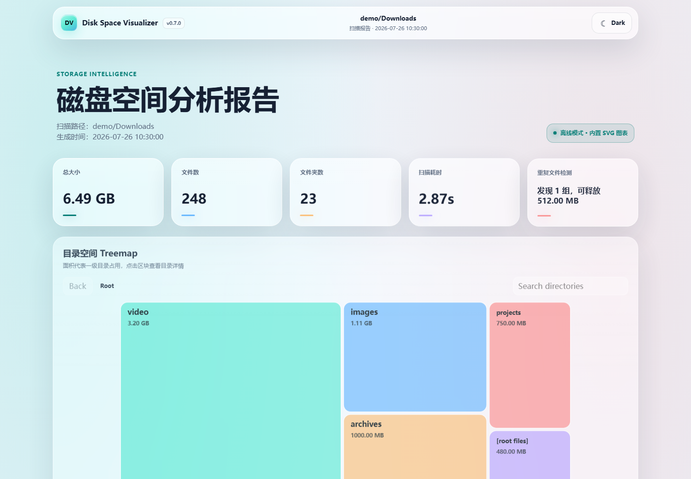
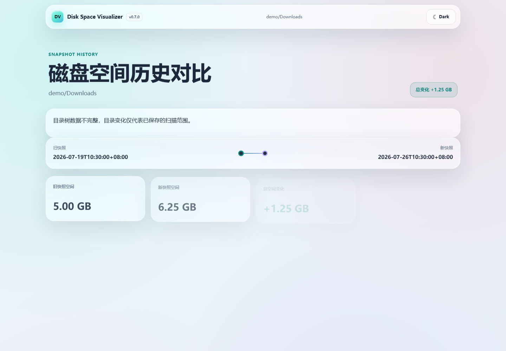
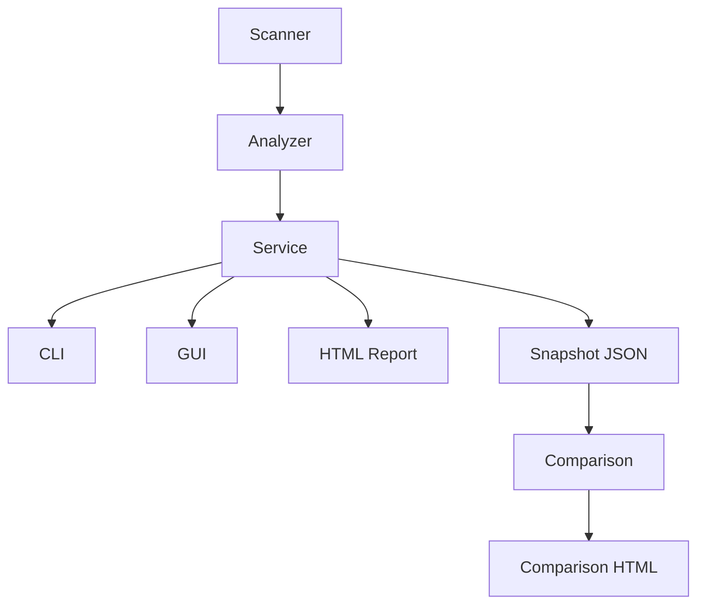

# Disk Space Visualizer

[](https://github.com/yangx1029-source/disk-space-visualizer/actions/workflows/test.yml)
[](https://www.python.org/)
[](LICENSE)
[](https://github.com/yangx1029-source/disk-space-visualizer/releases)

> 跨平台磁盘空间可视化分析器 · `v0.7.0`

Disk Space Visualizer 是一个使用 Python 开发的本地磁盘分析工具，命令行名称为
`diskvis`。它可以递归扫描目录、定位大文件、统计文件类型和一级目录占用、检测重复
文件，保存扫描快照、比较空间变化，并生成可直接打开的交互式 HTML 报告。项目同时
提供 CLI 与 Windows GUI，默认不会删除任何文件。



## 功能展示

### Dashboard

- 展示总大小、文件数、文件夹数、扫描耗时和重复文件检测状态。
- 使用 iOS Liquid Glass 风格的半透明卡片、背景光晕和克制的微动画。
- 支持深色/浅色主题、系统主题跟随和 `localStorage` 持久化。

### Treemap

- 按面积展示一级目录的空间占用比例。
- 悬停查看大小，点击区块查看完整目录、文件数和占用。
- 在线模式使用 ECharts 5.5.1，完全离线时使用内置 SVG Treemap。

### Snapshot Comparison

- 将一次 `AnalysisResult` 保存为结构稳定的 UTF-8 JSON 快照。
- 比较总空间、一级目录增长/减少和 Top 大文件新增/移除。
- 使用 Rich 输出变化排行，并可生成完全离线的 Liquid Glass 历史对比报告。



### Duplicate Detection

- 先按文件大小分组，只对同大小候选文件计算 SHA256。
- 使用分块读取，避免一次性加载大文件。
- 展示重复文件组和理论可节省空间，不执行自动删除。

## 功能特性

- 递归扫描本地目录，兼容 Windows、macOS 和 Linux 路径。
- 处理 `PermissionError`、`FileNotFoundError` 和扫描期间文件消失的情况。
- 跳过软链接目录，避免链接循环。
- 默认忽略 `node_modules`、`.git`、`dist`、`build`、`__pycache__`、`.venv`、
  `.idea` 和 `.vscode`。
- 支持 `100MB`、`1GB`、`500KB` 等最小文件大小过滤。
- 使用 Rich 显示扫描进度、概览和 Top N 表格。
- 支持结构化 UTF-8 JSON 导出。
- 使用 Jinja2 与 ECharts 生成交互式 HTML 报告。
- CDN 失败时自动使用 SVG 图表；`--offline` 模式完全不请求外部资源。
- 支持扫描快照保存、加载、目录差异和大文件历史对比。
- CLI 与 GUI 通过独立 Service 层复用同一业务流程。
- 使用 Pytest、Playwright、Ruff 和 GitHub Actions 完成质量验证。

## 技术栈

| 范畴 | 技术 |
| --- | --- |
| 语言 | Python 3.10+ |
| CLI | Typer |
| 终端 UI | Rich |
| 路径与数据模型 | pathlib、dataclass |
| HTML 报告 | Jinja2、ECharts 5.5.1、SVG fallback |
| GUI | Tkinter |
| 测试 | Pytest、Typer CliRunner、Playwright |
| 质量与构建 | Ruff、Hatchling、PyInstaller、GitHub Actions |

## 安装

### 从源码安装

```bash
git clone <your-repository-url>
cd disk-space-visualizer
python -m pip install -e .
```

安装开发与测试依赖：

```bash
python -m pip install -e ".[dev,browser]"
python -m playwright install chromium
```

安装后检查：

```bash
diskvis --help
```

如果 Windows 没有把 Python Scripts 目录加入 `PATH`，可以使用等价命令：

```powershell
py -m diskvis.cli --help
```

## 使用方法

### 扫描目录

```bash
diskvis scan ./Downloads
diskvis scan ./Downloads --top 20
diskvis scan ./Downloads --ignore node_modules --ignore .git --ignore dist
diskvis scan ./Downloads --min-size 100MB
diskvis scan ./Downloads --json report.json
```

`scan --json` 会额外保留完整文件清单；普通终端输出和 HTML 报告只携带展示所需数据。

`--ignore` 是可重复选项。自定义值会与默认忽略规则合并。

### 生成 HTML 报告

```bash
diskvis report ./Downloads
diskvis report ./Downloads --output reports/downloads-report.html
diskvis report ./Downloads --include-duplicates
diskvis report ./Downloads --offline
diskvis report ./Downloads --max-depth 5 --max-nodes 500 --tree-min-size 100MB
```

默认输出为 `reports/report.html`。在线模式加载锁定版本的 ECharts 5.5.1；如果 CDN
不可用，报告会自动切换到内置 SVG 图表。`--offline` 不加载任何外部脚本，适合断网
或内网环境。

### 查找重复文件

```bash
diskvis duplicates ./Downloads
diskvis duplicates ./Downloads --min-size 10MB
diskvis duplicates ./Downloads --top 20
```

该命令只报告结果，不会删除或移动文件。

### 保存扫描快照

```bash
diskvis snapshot ./Downloads
diskvis snapshot ./Downloads --top 20
diskvis snapshot ./Downloads --include-duplicates
diskvis snapshot ./Downloads --output snapshots/downloads.json
```

未指定 `--output` 时，快照保存到 `.diskvis/snapshots/`，文件名包含本地日期与时间，
例如 `snapshot-20260726-143000.json`。快照保留全部一级目录，`--top` 只控制大文件数量。

快照 JSON 包含：

- `metadata`：格式版本、带时区时间和扫描根路径。
- `summary`：总大小、文件数和文件夹数。
- `folders`：一级目录统计及相对路径。
- `files`：Top 大文件及相对路径。
- `duplicates`：是否检测、重复组数量和理论可节省空间。

### 比较两个快照

```bash
diskvis compare .diskvis/snapshots/old.json .diskvis/snapshots/new.json
diskvis compare old.json new.json --top 20
diskvis compare old.json new.json --output reports/comparison.html
```

Snapshot v2 记录完整多级目录树、平台路径语义、扫描参数、错误摘要和树完整性。
旧 v0.6/v1 快照仍可直接加载和比较，但会被标记为不完整，不会改写原 JSON。

终端会显示总空间变化、Top 增长目录、Top 减少目录、新增大文件和移出的大文件。
`--output` 会额外生成带时间轴和深浅主题的 Liquid Glass HTML 对比报告。

## Windows 软件版

运行：

```bat
scripts\build_windows.bat
```

构建结果：

- `dist\windows\DiskSpaceVisualizer.exe`：图形界面，双击即可使用。
- `dist\windows\diskvis.exe`：命令行工具，适合脚本与高级参数。
- `dist\DiskSpaceVisualizer-v0.7.0-Windows.zip`：可直接发送或解压使用的便携包。

将整个 `dist\windows` 文件夹复制到另一台 Windows 电脑即可运行，无需安装 Python。
GUI 标题、HTML 报告顶部和 Windows 文件属性都会显示当前 `v0.7.0`；
也可以执行 `diskvis.exe --version` 核对版本。

## HTML 报告截图

新版 Liquid Glass 报告截图位于：

```text
docs/assets/report-screenshot.png
```

重新生成示例报告与截图：

```bash
python scripts/generate_demo.py
python scripts/capture_demo_screenshot.py
```

示例文件位于 `examples/sample-report.html`，可以直接在浏览器打开。

## 项目架构



报告主链路：

```text
Scanner
   ↓
Analyzer
   ↓
Service
   ├── HTML Report
   └── Snapshot → Comparison → Comparison HTML
```

- **Scanner**：安全遍历文件系统并产出标准化 `FileInfo`。
- **Analyzer**：计算摘要、最大文件、类型、目录和大小区间统计。
- **Service**：统一编排扫描、分析、重复检测、建议和展示数据。
- **Snapshot**：只消费 `AnalysisResult`，负责历史数据保存、校验和纯差异计算。
- **CLI / GUI**：只负责输入、交互与结果展示，不互相依赖。
- **HTML Report**：渲染当前扫描或历史对比结果，并保持安全转义。

## 项目结构

```text
disk-space-visualizer/
├── diskvis/
│   ├── __init__.py
│   ├── cli.py
│   ├── gui.py
│   ├── service.py
│   ├── models.py
│   ├── scanner.py
│   ├── analyzer.py
│   ├── formatter.py
│   ├── exporter.py
│   ├── report.py
│   ├── snapshot.py
│   ├── duplicates.py
│   ├── recommender.py
│   └── templates/
│       ├── report.html.j2
│       └── comparison.html.j2
├── tests/
│   ├── test_cli.py
│   ├── test_service.py
│   ├── test_report.py
│   ├── test_snapshot.py
│   ├── test_comparison_report.py
│   └── test_report_browser.py
├── examples/
│   ├── sample-data.json
│   ├── sample-report.html
│   ├── sample-snapshot-old.json
│   ├── sample-snapshot-new.json
│   └── sample-comparison.html
├── scripts/
│   ├── generate_demo.py
│   ├── capture_demo_screenshot.py
│   └── build_windows.bat
├── packaging/windows/
├── docs/
│   ├── assets/report-screenshot.png
│   ├── assets/comparison-screenshot.png
│   ├── design.md
│   └── roadmap.md
├── .github/workflows/test.yml
├── CHANGELOG.md
├── LICENSE
├── README.md
└── pyproject.toml
```

## 核心实现

`scanner.py` 只负责文件系统遍历，返回 `FileInfo` 列表；`analyzer.py` 对该列表进行纯
数据分析；`service.py` 通过 `AnalysisOptions` 和 `AnalysisResult` 定义统一业务
边界。CLI 和 GUI 都调用 `analyze_directory()`，因此参数解析、桌面线程和核心算法
彼此隔离。

报告使用 Jinja2 自动转义 HTML 文本。图表 JSON 会额外转义 `<`、`>`、`&`，防止
文件名终止 `<script>`；ECharts tooltip 中的动态路径也会再次进行 HTML 转义。
在线报告使用固定版本 ECharts，断网或离线模式则由内置 SVG 渲染器输出五张图表。

`snapshot.py` 直接消费 `AnalysisResult`，不会重新扫描或复制 Analyzer 逻辑。比较时以
一级目录和 Top 大文件的相对路径作为稳定键，新增目录按 `0 → new_size` 计算，删除
目录按 `old_size → 0` 计算。对比结果既可传给 Rich 表格，也可传给 Jinja2 历史报告。

## 重复文件检测算法

1. 按文件大小预分组。
2. 只保留同大小且数量不少于 2 的候选组。
3. 对候选文件分块读取并计算 SHA256。
4. 再按 SHA256 分组，排除同大小但内容不同的文件。
5. 每组理论可节省空间为 `size * (count - 1)`。
6. 无法读取或扫描期间消失的文件会被跳过，不中断整次任务。

这种两阶段流程显著减少无效 hash 计算，尤其适合包含大量文件的大目录。

## 开发与测试

```bash
python -m ruff check .
python -m pytest
python -m build
python -m pip check
```

真实浏览器报告测试：

```bash
python -m pytest tests/test_report_browser.py -m browser
```

测试覆盖核心算法、Service、Snapshot schema、目录与文件差异、CLI 端到端流程、
XSS 防护、重复检测三态、Liquid Glass、主题持久化、Treemap，以及 390px/1440px
响应式布局。

## Roadmap

### v0.5 · Liquid Glass Report

- [x] Liquid Glass 设计系统。
- [x] Treemap 空间可视化。
- [x] 深色/浅色主题与偏好持久化。
- [x] 完整 SVG 离线降级。

### v0.6 · Snapshot Comparison

- [x] 保存、加载和校验扫描快照。
- [x] 比较一级目录增长与减少。
- [x] 识别 Top 大文件新增与移出。
- [x] 生成 Liquid Glass 历史对比报告。

### v0.7 · Deep Tree & Reliability

- [x] 深度目录树分析和多层级下钻。
- [x] 结构化进度、取消扫描、硬链接语义和稳定性保护。
- [x] Snapshot schema v2 与深层目录比较。

### v0.8 · Web Dashboard

- [ ] 独立本地 Web Dashboard。
- [ ] 多次快照趋势和空间变化筛选。

完整计划见 [docs/roadmap.md](docs/roadmap.md)。

## 简历描述

**Disk Space Visualizer 磁盘空间可视化分析器**

- 基于 Python、Typer、Rich 开发本地磁盘扫描工具，实现目录递归扫描、大文件排行、文件类型统计、重复文件检测和忽略规则配置。
- 使用 Jinja2 与 ECharts 生成 HTML 可视化报告，展示总览卡片、文件类型占比、一级文件夹占用和大文件排行榜。
- 基于版本化 JSON 快照实现磁盘空间历史对比，计算一级目录增长/减少及 Top 大文件新增/移出，并生成 Liquid Glass 对比报告。
- 设计基于文件大小预分组与 SHA256 的重复文件检测流程，减少无效 hash 计算，提高检测效率。
- 使用 Pytest 编写核心模块单元测试，并通过 GitHub Actions 实现自动化测试。

## License

本项目使用 [MIT License](LICENSE)。
